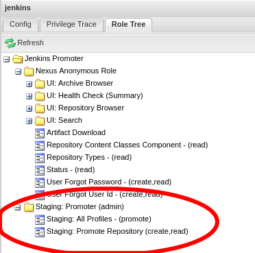

.. _lf-global-jjb-release:

Self-Serve Release Jobs
=======================

Self-serve release jobs allow project committers to direct Jenkins to
promote a jar file, container image or Python package from a staging
area to a release area.

To use the self-release process, create a releases/ or .releases/
directory at the root of the project repository, add one release yaml
file to it, and submit a change set with that release yaml file.  The
required contents of the release yaml file are different for each type
of release, see the schemas and examples shown below.  The version in
the release yaml file must be a valid Semantic Versioning (SemVer)
string, matching either the pattern "v#.#.#" or "#.#.#" where "#" is
one or more digits.  Upon merge of the change, Jenkins will sign the
reference extrapolated by log_dir and promote the artifact.

.. note::

   The release file regex is: (releases\/.*\.yaml|\.releases\/.*\.yaml).
   In words, the directory name can be ".releases" or "releases"; the file
   name can be anything with suffix ".yaml".

The build node for all release jobs must be CentOS, which supports the
sigul client for accessing a signing server. The build node for
container release jobs must have Docker installed.

A Jenkins admin user can also trigger a release job via the "Build
with parameters" action, removing the need to create and merge a
release yaml file.  The user must enter parameters in the same way as
a release yaml file, except for the special USE_RELEASE_FILE and
DRY_RUN check boxes. The user must uncheck the USE_RELEASE_FILE check
box if the job should run without a release file, instead passing the
required information as build parameters. The user can check the
DRY_RUN check box to test the job while skipping upload of files to
the release repository.

For example, the parameters for a Maven release are as follows::

    GERRIT_BRANCH = master
    VERSION = 1.0.0
    LOG_DIR = example-project-maven-stage-master/17/
    DISTRIBUTION_TYPE = maven
    USE_RELEASE_FILE = false
    DRY_RUN = false

Maven Release Files
-------------------

An example of a maven release file appears below.

.. code-block:: none

    $ cat releases/maven-release.yaml
    ---
    distribution_type: maven
    log_dir: example-project-maven-stage-master/17/
    project: example-project
    version: 1.0.0

The following parameters must appear in a maven release yaml file.

:Required Parameters:

    :distribution_type: Must be "maven".
    :log_dir: The suffix of the logs URL reported on completion by the
        Jenkins stage job that created and pushed the artifact
        to the staging repository.  For example, use value
        "example-project-maven-stage-master/17" for the logs URL
        https://logs.lf-project.org/production/vex-sjc-lfp-jenkins-prod-1/example-project-maven-stage-master/17
    :project: The name of the project.
    :version: The semantic version string used for the artifact.

The JSON schema for a maven release file appears below.

.. code-block:: none

    ---
    $schema: "http://json-schema.org/schema#"
    $id: "https://github.com/lfit/releng-global-jjb/blob/master/release-schema.yaml"

    required:
      - "distribution_type"
      - "log_dir"
      - "project"
      - "version"

    properties:
      distribution_type:
        type: "string"
      log_dir:
        type: "string"
      project:
        type: "string"
      version:
        type: "string"

Container Release Files
-----------------------

An example of a container release file appears below.

.. code-block:: none

    $ cat releases/container-release.yaml
    ---
    distribution_type: container
    container_release_tag: 1.0.0
    container_pull_registry: nexus.onap.org:10003
    container_push_registry: nexus.onap.org:10002
    project: test
    ref: d1b9cd2dd345fbeec0d3e2162e008358b8b663b2
    containers:
        - name: test-backend
          version: 1.0.0-20190806T184921Z
        - name: test-frontend
          version: 1.0.0-20190806T184921Z

The following parameters must appear in a container release yaml file.

:Required Parameters:

    :distribution_type: Must be "container".
    :container_release_tag: The string to use as a Docker tag on all
        released containers.
    :container_pull_registry: The Nexus registry that supplies the staged
        image(s).
    :container_push_registry: The Nexus registry that receives the released
        image(s).
    :project: The name of the project.
    :ref: The git commit reference (SHA-1 code) to tag with the version string.
    :containers: A list of name and version (tag) pairs that specify the
        Docker images in the container-pull registry to promote to the
        container-push registry.

The JSON schema for a container release file appears below.

.. code-block:: none

    ---
    $schema: "http://json-schema.org/schema#"
    $id: "https://github.com/lfit/releng-global-jjb/blob/master/release-container-schema.yaml"

    required:
      - "containers"
      - "distribution_type"
      - "project"
      - "container_release_tag"
      - "ref"

    properties:
      containers:
        type: "array"
        properties:
          name:
            type: "string"
          version:
            type: "string"
        additionalProperties: false
      distribution_type:
        type: "string"
      project:
        type: "string"
      container_release_tag:
        type: "string"
      container_pull_registry"
        type: "string"
      container_push_registry"
        type: "string"
      ref:
        type: "string"

PyPI Release Files
------------------

An example of a PyPI release file appears below.

.. code-block:: none

    $ cat releases/pypi-release.yaml
    ---
    distribution_type: pypi
    pypi_project: mypackage
    python_version: '3.4'
    version: 1.0.0

The following parameters must appear in the PyPI release yaml file.
These are not part of the Jenkins job definition to allow independent
self-release of a package maintained in a git repository with other
packages.

:Required Parameters:

    :distribution_type: Must be "pypi".
    :log_dir: The suffix of the logs URL reported on completion by the
        Jenkins merge job that created and pushed the distribution files
        to the staging repository.  For example, use value
        "example-project-pypi-merge-master/17" for the logs URL
        https://logs.lf-project.org/production/vex-sjc-lfp-jenkins-prod-1/example-project-pypi-merge-master/17
    :pypi_project: The PyPI project name at the staging and
        release repositories, for example "mypackage".
    :python_version: The Python interpreter version to use for pip
        "Requires-Python" compatibility checks, for example '3', '3.7' or 3.7.4.
        Put valid decimal values such as 3 or 3.7 in quotes to pass schema validation.
    :version: The semantic version string used for the package in the
        setup.py file.

The JSON schema for a PyPI release file appears below.

.. code-block:: none

    ---
    $schema: "http://json-schema.org/schema#"
    $id: "https://github.com/lfit/releng-global-jjb/blob/master/release-pypi-schema.yaml"

    required:
      - "distribution_type"
      - "log_dir"
      - "pypi_project"
      - "python_version"
      - "version"

    properties:
      distribution_type:
        type: "string"
      log_dir:
        type: "string"
      pypi_project:
        type: "string"
      python_version:
        type: "string"
      version:
        type: "string"

PackageCloud Release Files
--------------------------

An example of a PackageCloud release file appears below.

.. code-block:: none

    $ cat releases/packagecloud-release.yaml
    ---
    distribution_type: packagecloud
    package_name:
        - name: 'tree-1.6.0-10.el7.x86_64.rpm'
        - name: 'test.rpm'

The following parameters must appear in the PackageCloud release yaml file.
These are not part of the Jenkins job definition to allow independent
self-release of a package maintained in a git repository with other
packages.

:Required Parameters:

    :distribution_type: Must be "packagecloud".
    :package_name: A list of names that specify the packages to promote.

The JSON schema for a PackageCloud release file appears below.

.. code-block:: none

    ---
    $schema: "http://json-schema.org/schema#"
    $id: "https://github.com/lfit/releng-global-jjb/blob/master/packagecloud-release-schema"

    required:
      - "package_name"
      - "distribution_type"

    properties:
      package_name:
        type: "array"
        properties:
          name:
            type: "string"
    distribution_type:
      type: "string"

Jenkins Jobs
------------

An example of a Jenkins job configuration that uses the global-jjb
templates for maven and container release jobs appears next.

.. code-block:: none

    - project:
        name: my-project-release
        project: my-project
        project-name: my-project
        build-node: centos7-docker-4c-4g
        mvn-settings: my-project-settings
        jobs:
            - '{project-name}-gerrit-release-jobs'

.. note::

   Release Engineers: please follow the setup guide below before adding the job definition.

JJB Macros
----------

lf-release
~~~~~~~~~~

Release verify and merge jobs are the same except for their scm,
trigger, and builders definition. This anchor is the common template.

JJB Templates
-------------

Release Merge
~~~~~~~~~~~~~

This template supports Maven and Container release jobs.

:Template Name: {project-name}-release-merge

:Comment Trigger: remerge

:Required parameters:

    :build-node: The node to run build on.
    :jenkins-ssh-release-credential: Credential to use for SSH. (Generally set
        in defaults.yaml)
    :project: Git repository name
    :project-name: Jenkins job name prefix

:Optional parameters:

    :build-days-to-keep: Days to keep build logs in Jenkins. (default: 7)
    :build-timeout: Timeout in minutes before aborting build. (default: 15)

    :gerrit_merge_triggers: Override Gerrit Triggers.
    :gerrit_trigger_file_paths: Override file paths filter which checks which
        file modifications will trigger a build.
        **default**::

            - compare-type: REG_EXP
              pattern: '(releases\/.*\.yaml|\.releases\/.*\.yaml)'

Release Verify
~~~~~~~~~~~~~~

This template supports Maven and Container release jobs.

:Template Name: {project-name}-release-verify

:Comment Trigger: recheck|reverify

:Required Parameters:

    :build-node: The node to run build on.
    :jenkins-ssh-credential: Credential to use for SSH. (Generally set
        in defaults.yaml)
    :project: Git repository name
    :project-name: Jenkins job name prefix

:Optional Parameters:

    :build-days-to-keep: Days to keep build logs in Jenkins. (default: 7)
    :build-node: The node to run build on.
    :build-timeout: Timeout in minutes before aborting build. (default: 15)
    :gerrit-skip-vote: Skip voting for this job. (default: false)
    :git-url: URL clone project from. (default: $GIT_URL/$PROJECT)

    :gerrit_verify_triggers: Override Gerrit Triggers.
    :gerrit_trigger_file_paths: Override file paths filter which checks which
        file modifications will trigger a build.
        **default**::

            - compare-type: REG_EXP
              pattern: '(releases\/.*\.yaml|\.releases\/.*\.yaml)'

PyPI Release Merge
~~~~~~~~~~~~~~~~~~

Publishes a Python package on merge of a patch set with a release yaml
file. Checks the format of the version string, downloads the package
artifacts from the PyPI staging repository, uploads the package
artifacts to the PyPI release repository, tags the git repository,
signs the tag and pushes the tag to the git server. The release verify
template accepts neither a branch nor a stream parameter.

:Template Names:

    - {project-name}-pypi-release-merge
    - gerrit-pypi-release-merge
    - github-pypi-release-merge

:Comment Trigger: remerge

:Required Parameters:

    :build-node: The node to run build on, which must be Centos.
    :jenkins-ssh-release-credential: Credential to use for SSH. (Generally set
        in defaults.yaml)
    :project: Git repository name
    :project-name: Jenkins job name prefix

:Optional Parameters:

    :build-days-to-keep: Days to keep build logs in Jenkins. (default: 7)
    :build-timeout: Timeout in minutes before aborting build. (default: 15)
    :disable-job: Whether to disable the job (default: false)
    :git-url: URL clone project from. (default: $GIT_URL/$PROJECT)
    :pypi-stage-index: Base URL of the PyPI staging repository.
        (default https://test.pypi.org/simple)
    :pypi-repo: Key for the PyPI release repository in the .pypirc file,
        should be the repository pypy.org. (default: pypi)
    :use-release-file: Whether to use the release file. (default: true)

PyPI Release Verify
~~~~~~~~~~~~~~~~~~~

Verifies a Python package project on creation of a patch set with a
release yaml file. Checks the contents of the release yaml file,
checks the format of the version string, and downloads the release
artifacts from the specified PyPI staging repository. The release
verify template accepts neither a branch nor a stream parameter.

:Template Names:

    - {project-name}-pypi-release-verify
    - gerrit-pypi-release-verify
    - github-pypi-release-verify

:Comment Trigger: recheck

:Required Parameters:

    :build-node: The node to run build on, which must be Centos.
    :jenkins-ssh-credential: Credential to use for SSH. (Generally set
        in defaults.yaml)
    :project: Git repository name
    :project-name: Jenkins job name prefix

:Optional Parameters:

    :build-days-to-keep: Days to keep build logs in Jenkins. (default: 7)
    :build-timeout: Timeout in minutes before aborting build. (default: 15)
    :disable-job: Whether to disable the job (default: false)
    :git-url: URL clone project from. (default: $GIT_URL/$PROJECT)
    :pypi-stage-index: Base URL of the PyPI staging repository.
        (default https://test.pypi.org/simple)
    :pypi-repo: Key for the PyPI release repository in the .pypirc file,
        should be the repository pypy.org (default: pypi)
    :use-release-file: Whether to use the release file. (default: true)

Setup for LFID, Nexus, Jenkins and Gerrit
-----------------------------------------

This section is for the Linux Foundation release engineering team.

LFID
~~~~

Create an ``lfid`` and an ``ssh-key``

``YOUR_RELEASE_USERNAME`` for example: onap-release

``YOUR_RELEASE_EMAIL`` for example: collab-it+onap-release@linuxfoundation.org

ssh-key example:

.. code-block:: bash

   ssh-keygen -t rsa -C "collab-it+odl-release@linuxfoundation.org"  -f /tmp/odl-release

`Create an LFID with the above values <https://identity.linuxfoundation.org>`_

Nexus
~~~~~

Create a Nexus account called ``'jenkins-release'`` with promote privileges.

Gerrit
~~~~~~

Log into your Gerrit with ``YOUR_RELEASE_USERNAME``, upload the public
part of the ``ssh-key`` you created earlier. Log out of Gerrit and log
in again with your normal account for the next steps.

In Gerrit create a new group called ``self-serve-release`` and give it
direct push rights via ``All-Projects`` Add ``YOUR_RELEASE_USERNAME``
to group ``self-serve-release`` and group ``Non-Interactive Users``

In All project, grant group self-serve-release the following:

.. code-block:: none

    [access "refs/heads/*"]
      push = group self-serve-release
    [access "refs/tags/*"]
      createTag = group self-serve-release
      createSignedTag = group self-serve-release
      forgeCommitter = group self-serve-release
      push = group self-serve-release

Jenkins
~~~~~~~

Add a global credential to Jenkins called ``jenkins-release`` and set
the ID: ``'jenkins-release'`` as its value insert the private half of
the ``ssh-key`` that you created for your Gerrit user.

Add Global variables in Jenkins:
Jenkins configure -> Global properties -> Environment variables::

    RELEASE_USERNAME = YOUR_RELEASE_USERNAME
    RELEASE_EMAIL = YOUR_RELEASE_EMAIL

.. note::

    Add these variables to your global-vars-$SILO.sh file or they will
    be overwritten.

Jenkins configure -> Managed Files -> Add a New Config -> Custom File

.. code-block:: none

    id: signing-pubkey
    Name: SIGNING_PUBKEY (optional)
    Comment: SIGNING_PUBKEY (optional)

    Content: (Ask Andy for the public signing key)
    -----BEGIN PGP PUBLIC KEY BLOCK-----

Add or edit the managed file in Jenkins called ``lftoolsini``,
appending a nexus section: Jenkins Settings -> Managed files -> Add
(or edit) -> Custom file

.. code-block:: none

   [nexus.example.com]
   username=jenkins-release
   password=<plaintext password>

Ci-management
~~~~~~~~~~~~~

Upgrade your project's global-jjb if needed, then add the following to
your global defaults file (e.g., jjb/defaults.yaml).

.. code-block:: none

   jenkins-ssh-release-credential: jenkins-release
